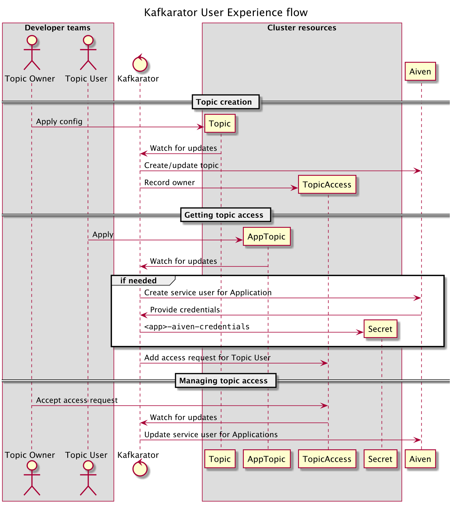

# 8. User experience

Date: 2020-06-19

## Status

Under discussion

See also [6. Kafkarator API is focused around dedicated CRDs](0006-kafkarator-api-is-focused-around-dedicated-crds.md)

## Context

While CRDs are a good API for Kubernetes Operators, they are not in common use for most developers, and a better
user experience is wanted.

Users today are used to creating an Application object to deploy their application. For users who are not owning a
topic, it would be easier if they can declare their topics as part of the Application resources. However, if we design
our CRDs to be simple enough, this might not be a real problem.

There are other use cases where parts of the Application object are translated into a specific CRD handled by a separate
operator. This model could also be used here. This will move some of the responsibility from the users to Naiserator,
but at the same time create an unnecessary coupling to Naiserator. 

By making sure our flow is built around a set of CRDs, details of the UI can be worked on iteratively, refining the 
experience as we get more experience. 

In order to do this, we will need more than the two CRDs detailed in [6. Kafkarator API is focused around dedicated CRDs](0006-kafkarator-api-is-focused-around-dedicated-crds.md).

The flow can be separated into three distinct parts:

- Topic creation
- Getting topic access
- Managing topic access

### A suggested flow

#### Topic creation

1. A developer creates a Topic CRD in their team namespace, detailing the topic name and configuration (1) 
2. Kafkarator sees the Topic and
    1. Creates the topic in the Aiven cluster
    2. If the team does not already have a service user in Aiven, it is created
    3. Creates a TopicAccess CRD object, recording the team as owner of this Topic

#### Getting topic access

1. A developer creates an AppTopic CRD in their team namespace, connecting an application with topics for either 
   producing or consuming (2)
2. Kafkarator sees the AppTopic and
    1. If the team does not already have a service user in Aiven, it is created
    2. Downloads credentials for service user
    3. Creates a Kubernetes secret in the team namespace if on GCP (3)
    4. Creates a Vault secret if on-site (3)
    5. Adds an access request to the TopicAccess associated with this Topic

#### Managing topic access

1. A topic owner edits the TopicAccess CRD to accept an access request (4)
2. Kafkarator sees the TopicAccess change and
    1. Updates ACL for the service users, granting or removing access to a Topic
    
#### Future work

(1) It could be useful to create a UI for topic creation, with links to documentation for each option and easy 
access to "common" options, but it does not seem worth the effort at this time.

(2) As discussed, this could be done indirectly by specifying the topics in the Application CRD and letting Naiserator
create the AppTopic CRD.

(3) Application developers need to make sure their application requests access to the correct secrets to get the Aiven
credentials. This could be handled by Naiserator automatically, by simply mounting the secret in a predefined location
if it exists.

(4) Later iterations might want to provide a UI for teams to manage access, instead of editing CRDs directly. This would
reduce the chance of errors, but requires proper access control in the UI which is already provided by Kubernetes.

## Decisions

- We will keep the CRDs as detailed in [6. Kafkarator API is focused around dedicated CRDs](0006-kafkarator-api-is-focused-around-dedicated-crds.md)
  with further refinements as described above.
- Kafkarator will create topic and provide credentials as Secrets based on CRDs
- We make no integration with Naiserator at this time, but leave an opening for doing so in the future, as detailed
  under [Future work](#future-work)

## Consequences

This will be good enough for us to open up for users, so that we can gather feedback and experience before developing
the user experience further.

Users needs to work directly with CRDs, especially topic owners. 